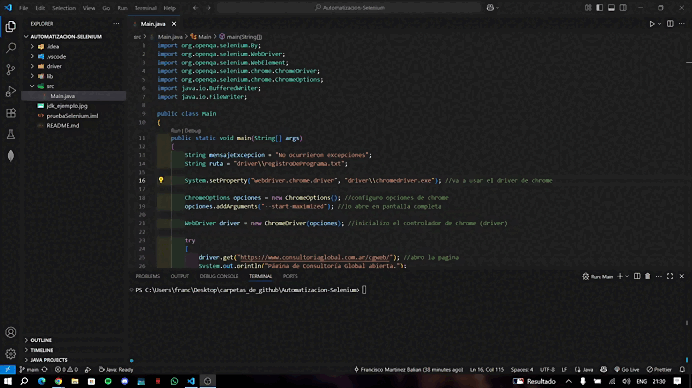
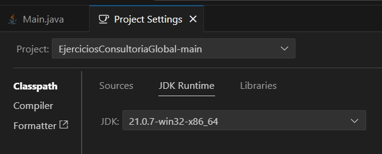

# 🤖 Automatización con Selenium: Formulario Consultoría Global

Este proyecto automatiza la interacción con el formulario de contacto del sitio web [Consultoría Global](https://www.consultoriaglobal.com.ar/cgweb/) utilizando **Java** y **Selenium WebDriver**. Simula el ingreso de datos en el formulario y captura los mensajes de error de validación.

## 📝 Descripción

El programa abre el sitio web de Consultoría Global, navega a la sección de contacto, completa el formulario con datos simulados (incluyendo un correo inválido para provocar errores y un captcha cualquiera) y presiona el botón de "Enviar". Finalmente, captura el mensaje de error que se muestra en pantalla y lo muestra en la consola.

Es un código simple, que fue realizado como requisito para pasar una entrevista técnica en la consultoría.

## ⚙️ Tecnologías utilizadas

- Java 17 o superior
- Selenium WebDriver
- Google Chrome + ChromeDriver

## 📌 Requisitos

- JDK 17 o superior
- Google Chrome instalado
- El ejecutable `chromedriver.exe` compatible con la versión de Chrome (colocado en la carpeta `driver/`)

## 📦 Dependencias externas

Agregá el JAR de Selenium WebDriver en tu proyecto. Podés usar Maven/Gradle o descargarlo manualmente desde:

- [Página Selenium oficial](https://www.selenium.dev/downloads)

También, se debe tener en cuenta la versión del driver y de Google Chrome:

- [Descargar driver de Google Chrome](https://developer.chrome.com/docs/chromedriver/downloads/version-selection?hl=es-419)
- [Versiones](https://googlechromelabs.github.io/chrome-for-testing/)

Asegurate de incluir:

- `selenium-java-4.x.x.jar`
- Y las dependencias que vienen en la carpeta `libs/` del `.zip` descargado

## ❕ Aclaración

Este proyecto fue realizado en Visual Studio Code, de manera tal que ya se incluye la carpeta .vscode para que el código se ejecute correctamente. Dependiendo del IDE en el que se ejecute, se deberá configurar el entorno correctamente para que funcione.

Más allá de los requisitos y las dependecias aclaradas anteriormente, si el código se quiere ejecutar desde el Visual Studio Code, se tiene que usar la versión correcta del JDK, abrir la carpeta de este repo directamente en el Visual, y ejecutar el Main con `Run Java`

